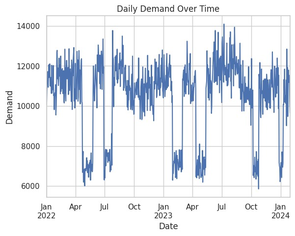
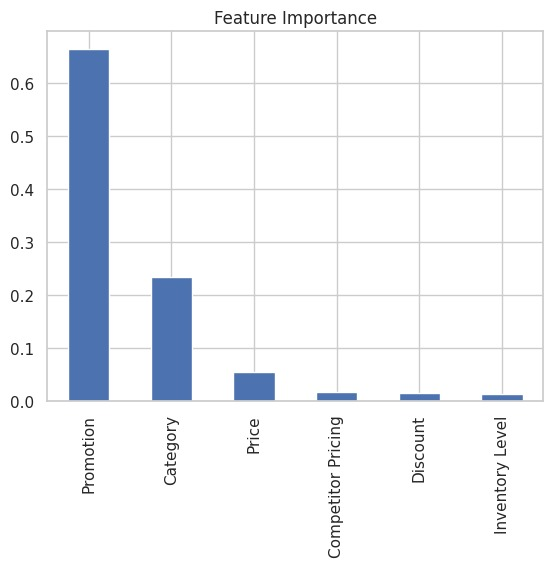
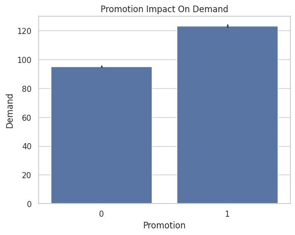

# 📈 Demand Forecasting & Prediction System

An end-to-end machine learning project for predicting product demand using Python, XGBoost, and Scikit-learn. This project demonstrates the complete machine learning workflow, from data preprocessing and exploratory data analysis (EDA) to model training, evaluation, and deployment through an interactive Streamlit application.

## 📌 Project Overview

Accurate demand forecasting helps businesses optimize inventory, reduce operational costs, and make better data-driven decisions.

This project uses historical demand data and machine learning techniques to predict future demand based on relevant product and business features.

The project includes data visualization, data preprocessing, feature engineering, model training, evaluation, model serialization, and deployment of the trained model through a Streamlit web application.

## 📊 Visualizations

### 📈 Daily Demand Over Time

This visualization shows daily demand patterns from 2022 to 2024, highlighting fluctuations and periods of higher and lower demand.



### 🎯 Feature Importance

This visualization shows the relative importance of the features used by the XGBoost model, highlighting which variables contribute most to demand predictions.



### 📢 Promotion Impact on Demand

This visualization explores the relationship between promotional activity and demand, providing insights into how promotions influence predicted demand.



## ✨ Features

📊 Exploratory Data Analysis (EDA)  
🧹 Data preprocessing and cleaning  
⚙️ Feature engineering  
🤖 XGBoost machine learning model  
📈 Model evaluation  
📉 Data visualization  
💾 Saved trained model using Pickle  
🔤 Saved label encoders for preprocessing  
🖥️ Interactive Streamlit prediction application  
🔄 Reusable prediction pipeline  

## 🛠️ Technologies Used

Python  
Pandas  
NumPy  
Matplotlib  
Seaborn  
Scikit-learn  
XGBoost  
Streamlit  
Pickle  
Jupyter Notebook  
Google Colab  

## 📂 Project Structure

```text
demand-forecasting/
│
├── Demand_Forecasting_Project.ipynb
├── app.py
├── xgb_model.pkl
├── label_encoders.pkl
├── demand_forecasting.csv
└── README.md
